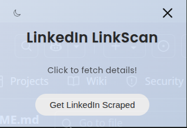
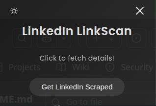
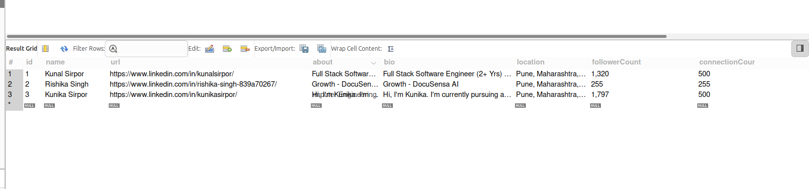
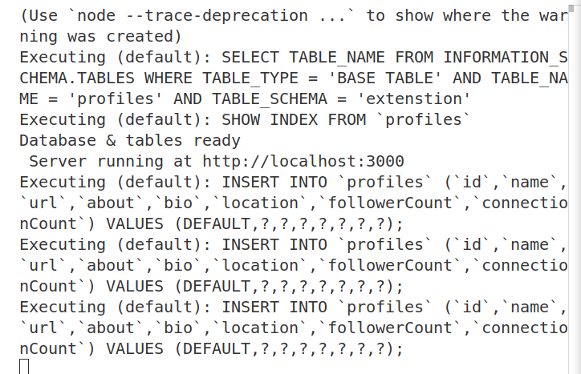

# 🔗 LinkedIn Scraper Chrome Extension

This Chrome Extension automatically scrapes LinkedIn profile information (like name, bio, location, followers, and connection count) from a list of LinkedIn profile URLs and sends the data to a Node.js + Express backend.

## Features

- Scrapes:
  - Name
  - Bio / About
  - Location
  - Follower Count
  - Connection Count
  - Profile URL
- Sends scraped data to your backend via POST request
- Beautiful UI with light/dark mode toggle
- Stylish transition effects
- Manual "Fetch Details" trigger

---

## 🛠Technologies Used

- **Chrome Extension (Manifest v3)**
- **JavaScript**
- **Node.js + Express + Sequelize (Backend)**
- **MYSQL Database**
- **CSS (custom animations & transitions)**

---
## 📸 Screenshots

### 🔹 LinkedIn Scraper UI

Light Mode  


---

Dark Mode  


---

### 🔹 Database Preview  
Fetched details successfully stored in MySQL database.



---

### 🔹 Terminal Output  
Console showing successful execution and data transmission.



---

## How to Use

### 1. Clone the repository

```bash
git clone https://github.com/kunikasirpor/linkedin-scraper-extension.git
cd linkedin-scraper-extension
